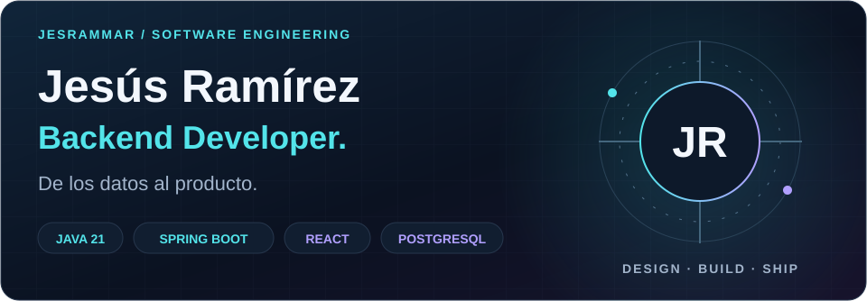
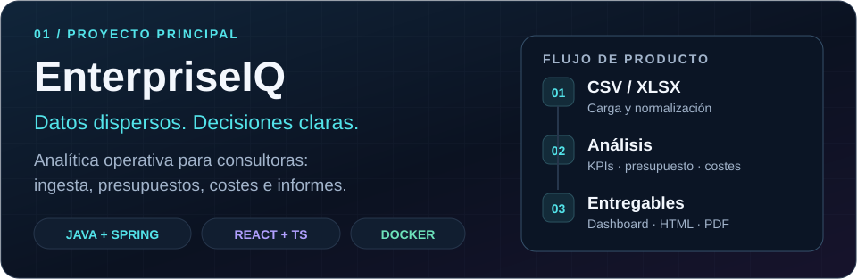
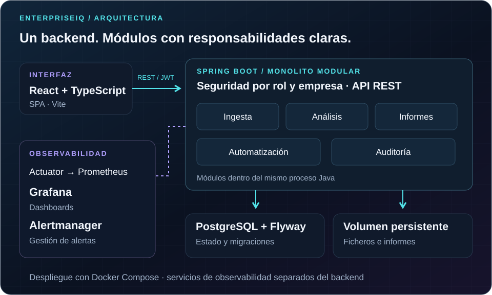
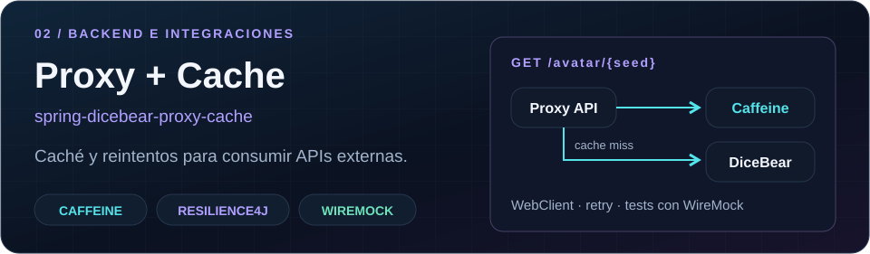
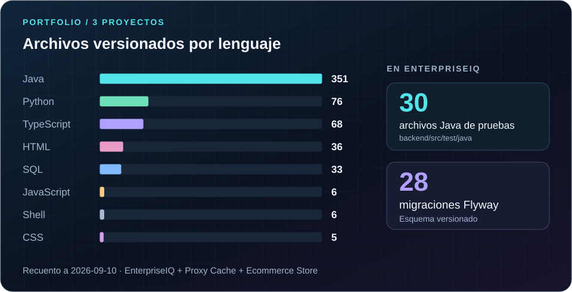

  

  Ingeniería del Software · Universidad de Sevilla 
  Desarrollo productos completos con foco en backend Java/Spring Boot.

  <a href="mailto:jramirezsoftware@gmail.com"><strong>Email</strong></a> &nbsp; / &nbsp;
  <a href="https://www.linkedin.com/in/jes%C3%BAs-ram%C3%ADrez-mart%C3%ADnez-901685412/"><strong>LinkedIn</strong></a> &nbsp; / &nbsp;
  <a href="#enterpriseiq"><strong>EnterpriseIQ</strong></a> &nbsp; / &nbsp;
  <a href="https://github.com/jesrammar/spring-dicebear-proxy-cache"><strong>Proxy + Cache</strong></a>

Busco mi primera oportunidad profesional en desarrollo. Me interesa trabajar en APIs, integraciones y procesamiento de datos, con pruebas automatizadas y una operación bien documentada.

## Proyectos seleccionados

Mi proyecto principal: una plataforma para que una consultora gestione varias empresas y transforme sus ficheros operativos y financieros en información para decidir. Integra autenticación por roles y empresa, normalización de datos, análisis y entregables HTML/PDF.

**Java 21 · Spring Boot · React / TypeScript · PostgreSQL · Flyway · Docker**

El código de EnterpriseIQ es privado. [Contacta conmigo para conocer el proyecto](mailto:jramirezsoftware@gmail.com?subject=EnterpriseIQ).

<strong>Explorar la arquitectura de EnterpriseIQ</strong>

 

El backend concentra seguridad, ingesta, análisis, automatización e informes en un único proceso Java. PostgreSQL conserva el estado y un volumen almacena ficheros. La configuración de producción incorpora servicios separados de observabilidad.

 

API que centraliza el consumo de DiceBear, evita llamadas repetidas con caché y controla fallos transitorios con reintentos. Incluye pruebas con WireMock, documentación OpenAPI, Actuator y CI con Maven.

[**Explorar código, pruebas y ejecución →**](https://github.com/jesrammar/spring-dicebear-proxy-cache)

## Ingeniería en el repositorio

Instantánea del código de EnterpriseIQ. Los archivos de pruebas y las migraciones forman parte del gráfico; no son sumas adicionales. [Datos y método del recuento](data/repository-snapshot.json).

---

Diseño de APIs · Seguridad · Testing · CI · Observabilidad 
**Construir, comprobar y documentar.**
